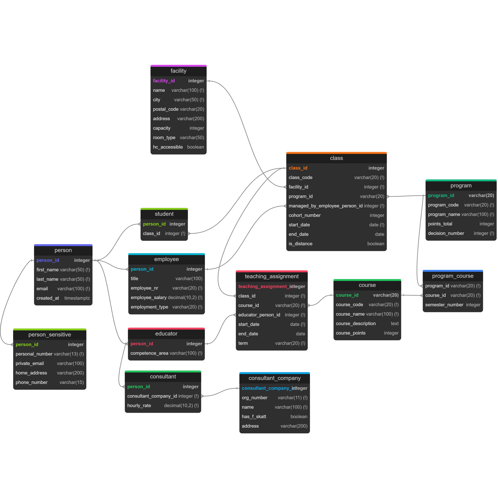

# Data Modeling Lab — YrkesCo (PostgreSQL + Docker)


**Lab for the Data Modeling course in the Data Engineer 2025 program at STI.**  



## This repository contains a complete data modeling workflow for a fictional polytechnic school called **YrkesCo**.
### The project moves from conceptualization to a fully containerized physical implementation with automated quality assurance.

## Goals
- Design a relational model (CDM --> LDM --> PDM) matching complex business requirements.  
- Implement the physical model in **PostgreSQL** using **Docker**.  
- Ensure **Data Integrity** through strict constraints and Sanity Checks.  
- Provide reproducible, idempotent scripts for seamless deployment

---

## Key Features
- **Idempotent Architecture:** Scripts are designed to provide safe re-execution and predictable results.  
`01_ddl` rebuilds the schema, while `02_seed` uses `ON CONFLICT`  to ensure consistent data states across multiple runs.

- **Automated quality assurance:** Includes a custom Sanity Check script (`04_sanity_checks.sql`) that validates business logic and data consistency automatically.
- **3NF & Shared Keys:** Implements Super / subtypes with Shared Primary Keys to reduce redundant surrogate keys and keep subtype tables aligned 1:1 with `person`
- **Documentation:** Extensive `Evidence` folder with documentation for every step of this lab. [Click Here to view](docs/evidence/output.md) 


## Tech stack

- PostgreSQL (Docker image)
- Docker Compose
- SQL (DDL / seed / queries)
- dbdiagram (DBML --> PDM reference)
- Mermaid + Lucidchart exported diagrams


## Quick Start
**Prerequisites:** Docker Desktop installed.

**Start the environment:**  
`docker compose -f docker/docker-compose.yml --env-file docker/.env up -d`

[Click Here for a step by step guide](docs/evidence/output.md)  [Or click here for the commands needed to run docker](docs/runbook_docker.md)

---

## Repository structure

```text
.
├─ docker/
│  ├─ docker-compose.yml
│  ├─ .env.example
│  └─ .env                # not committed (local only)
│
├─ sql/
│  ├─ 01_ddl.sql
│  ├─ 02_seed.sql
│  ├─ 03_queries.sql
│  └─ 04_sanity_checks.sql
│
├─ docs/
│  ├─ conceptual/
│  │  ├─ erd_conceptual_final_mermaid.mmd   # final version of conceptual ERD written with mermaid
│  │  ├─ erd_conceptual_final_v3.png        # final version of conceptual ERD made in lucidchart
│  │  ├─ relationship_statements.md         # relationship statements for conceptual ERD written in Swedish
│  │  ├─ entities_draft.md                  # written notes of my thought process prior to making conceptual ERD.
│  │  ├─ conceptual_drafts/                 # drafts of conceptual ERD versions marked v1, v2.... ... 
│  │  └─ mermaid/                           # drafts of conceptual ERD in mermaid
│  │
│  ├─ logical/
│  │  ├─ erd_logical_final_mermaid.mmd      # final version of logical ERD written with mermaid 
│  │  ├─ erd_logical_final_v2.0.png         # final version of logical ERD made in lucidchart
│  │  ├─ yrkesco_logical_data_model.md      # notes regarding final logical ERD explaining 3NF + super/subtypes
│  │  └─ logical_drafts/                    # drafts of logical ERD versions marked v1, v2... ...
│  │
│  ├─ physical/
│  │  ├─ erd_physical_final_v1.dbml         # final version of physical ERD made with .dbml file
│  │  ├─ pdm_export_postgres_dbdiagram.sql  # exported final version of my physical ERD, exported from dbdiagram.io
│  │  ├─ erd_physical_dbdiagram.png         # exported PNG from dbdiagram.io
│  │  ├─ erd_physical_final_dbml.png        # final version of physical ERD in PNG
│  │  └─ physical_drafts/
│  │
│  ├─ evidence/
│  │  ├─ output.md                          # documentation of expected outputs, commands, bug discovery + fixes
│  │  ├─ design_decisions.md                # documentation regarding design decisions for this lab.
│  │  └─ quality_assurances.md              # documentation regarding and reasining behind sanity_check script.
│  │
│  ├─ screenshots/
│  │  ├─ query_*.png                        # screenshots of all ran queries and output from 03_queries.sql
│  │  └─ bug_*.png                          # screenshots of discovered bug after 04_sanity_checks.sql and bug fixes.
│  │
│  ├─ runbook_docker.md                     # important docker commands to navigate easier in the CLI
│  ├─ super_subtypes_shared_pk.png          # own made 'diagram' to visualize super/subtypes and shared PKs better
│  ├─ surrogate_keys_usage.png              # own made 'diagram' to visualize the difference with surrogate keys/shared PKs
│  ├─ lab_yrkesco.md                        # the lab written down in markdown
│  └─ lab_yrkesco.pdf                       # the original lab in .pdf format
│ 
│ 
├─ notes.md                              # document with collected sources, reference list.
│
└─ README.md

```

### [Sources - for full Academic transparency and Academic integrity click here](notes.md)


