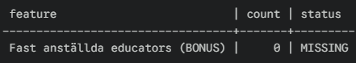
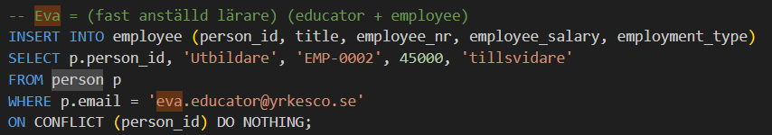
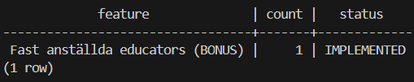

# Documentation file for outputs.  
## **Purpose with this file:**  

- The purpose of this output.md file is to provide evidence of my outputs and a step by step guide on how to replicate my database. All my evidence is saved in .png format with screenshots of all separate outputs. This document is made for them who'd like to replicate my database with step by step instructions and if somehow my screenshots arent able to be viewed. 

- How to build it and get the same output by following these steps with these commands. The output should work on any machine with Docker installed. Output formatting can vary depending on what OS you are using and how your terminal looks, my point is. If the prerequisites are there, you should get the exact same outputs as written.  
**(The INSERT row counts may differ however, often 0 on subsequent runs)**

- For this lab I have taken the necessary steps to make my database idempotent where ever possible, thanks to `ON CONFLICT DO NOTHING`. You can run the scripts as many times as you'd like and still get the same results. Just as a proof of concept.

- With Idempotent regarding to this lab I am talking about:
  - `01_ddl.sql`: rebuilds the schema(drop/create).

  - `02_seed.sql`: idempotent'ish thanks to `ON CONFLICT DO NOTHING`.

  - `03_queries.sql`: idempotent thanks to read only. Same results using the same data. Results will differ depending if anything is added to. `02_seed.sql`

  - `04_sanity_checks.sql` read only verification.


### Step 1:  

1) Start by setting up your .env file. I have provided an example file in my docker folder called `.env.example`. Copy said .env.example file and change what is needed (the file name should be .env, and you might want to change the username and or password).  

2) Copy the `docker-compose.yml` file. 
- My `docker-compose.yml` file is built on that both the `.env` and the `docker-compose.yml` file is the /docker folder and that the /sql folder is in its own separate folder.  
- If you change container_name, update the docker exec .... commands accordingly.

3) Run from the repo root in your terminal and **wait** a little bit.  
- `docker compose -f docker/docker-compose.yml --env-file docker/.env up -d`   

4) Do a process status check with `docker ps`. If you see that the status is **healthy** move on to step 2.


### Step 2:  
**You are now able to run the .sql scripts to start building your PostgreSQL database.**  
1) Start by running this command  
`docker exec -it lab_yrkesco_postgres bash -lc "psql -U \$POSTGRES_USER -d \$POSTGRES_DB -f /sql/01_ddl.sql"`  
  - Expected output should be: 

**(NOTICE, MESSAGES REGARDING MISSING TABLES ARE TO BE EXPECTED DURING THE FIRST RUN DUE TO THE IF EXISTS CLAUSE)**

```
BEGIN
psql:/sql/01_ddl.sql:8: NOTICE:  table "teaching_assignment" does not exist, skipping
DROP TABLE
...
...
CREATE TABLE
CREATE TABLE
CREATE TABLE
CREATE TABLE
CREATE TABLE
CREATE TABLE
CREATE TABLE
CREATE TABLE
CREATE TABLE
CREATE TABLE
CREATE TABLE
CREATE TABLE
CREATE TABLE
COMMIT
```

### Step 3:  
**Once you have gotten the same output as in step 2. Move on to seeding the database**  
1) Time to run the seed script. Use this command to seed it  
`docker exec -it lab_yrkesco_postgres bash -lc "psql -U \$POSTGRES_USER -d \$POSTGRES_DB -f /sql/02_seed.sql"`  
  - Expected output should be:  
```
$ docker exec -it lab_yrkesco_postgres bash -lc "psql -U \$POSTGRES_USER -d \$POSTGRES_DB -f /sql/02_seed.sql"
BEGIN
INSERT 0 1
INSERT 0 1
INSERT 0 1
INSERT 0 1
INSERT 0 6
INSERT 0 5
INSERT 0 1
INSERT 0 1
INSERT 0 1
INSERT 0 1
INSERT 0 1
INSERT 0 1
INSERT 0 1
INSERT 0 1
INSERT 0 1
INSERT 0 1
INSERT 0 1
INSERT 0 1
INSERT 0 1
INSERT 0 2
INSERT 0 1
INSERT 0 1
INSERT 0 1
INSERT 0 1
INSERT 0 1
INSERT 0 1
COMMIT
```

## Step 4:  
**Once you have gotten the same output as in step 3, your database has been seeded. You can now move on to queries**  
1) Time to run the query script. You do that by running this command in your terminal  
`docker exec -it lab_yrkesco_postgres bash -lc "psql -U \$POSTGRES_USER -d \$POSTGRES_DB -f /sql/03_queries.sql"`
  - Expected output should be:
```
$ docker exec -it lab_yrkesco_postgres bash -lc "psql -U \$POSTGRES_USER -d \$POSTGRES_DB -f /sql/03_queries.sql"

=================================
Query 1A: Student roster, Class, Program and Location including program classes and stand alone classes
Purpose: Retrieving all students with their class, program, and campus city
=================================
 first_name | last_name |          email          | class_code | program_name  |   city    
------------+-----------+-------------------------+------------+---------------+-----------
 Sara       | Student   | sara.student@yrkesco.se | DE25-01    | Data Engineer | Stockholm
 Nils       | Student   | nils.student@yrkesco.se | FREE-01    |               | Göteborg
(2 rows)


=================================
Query 1B: Student roster, Program, Class and city
Purpose: Retrieving all students with their class tied to a specific program and which campus
=================================
 first_name | last_name |          email          | class_code | program_name  |   city
------------+-----------+-------------------------+------------+---------------+-----------
 Sara       | Student   | sara.student@yrkesco.se | DE25-01    | Data Engineer | Stockholm
(1 row)


=================================
Query 2A: Educator status (Consultants + Employees)
Purpose: Identifying consultants using Boolean logic (IS NOT NULL, PostgreSQL SPECIFIC variant)
=================================
 first_name | last_name  | competence_area | is_consultant | consultant_company | hourly_rate
------------+------------+-----------------+---------------+--------------------+-------------
 Conny      | Consultant | SQL             | t             | ConsultCo AB       |     1200.00
 Eva        | Educator   | Data Modeling   | f             |                    |
(2 rows)


=================================
Query 2B: Educator status (Consultants + Employees)
Purpose: Identifying consultants using Boolean logic (CASE WHEN..ELSE..END.. STANDARD SQL variant)
=================================
 first_name | last_name  | competence_area | is_consultant | consultant_company | hourly_rate
------------+------------+-----------------+---------------+--------------------+-------------
 Conny      | Consultant | SQL             | t             | ConsultCo AB       |     1200.00
 Eva        | Educator   | Data Modeling   | f             |                    |
(2 rows)


=================================
Query 3: Program status (Program code, Semester nr, Course code, name and points
Purpose: Identifying relevant Course information tied to a Program
=================================
 program_code | semester_number | course_code |    course_name     | course_points
--------------+-----------------+-------------+--------------------+---------------
 DE25         |               1 | SQL101      | SQL Basics         |            50
 DE25         |               1 | ETL101      | ETL Pipelines      |            50
 DE25         |               2 | DM101       | Data Modeling      |            50
 DE25         |               2 | PY101       | Python Programming |            50
 DE25         |               2 | LIA         | Internship         |           150
(5 rows)


=================================
Query 4: Standalone Courses(Freestanding Courses)
Purpose: Identifying courses not tied to a specific Program. (NULL VALUE == Standalone Course)
=================================
 course_code |   course_name
-------------+-----------------
 FREE01      | Fristående kurs
(1 row)


=================================
Query 5A: Class Administrator TOTAL workload
Purpose: Identifying number of TOTAL CLASSES managed by a Class admin
=================================
Business ambiguity identified. Requirements did not specify LIMIT to numbers of classes managed by admin
Recommendation: Review wording in business requirements to not overload Class admins with too much work!
=================================
 first_name | last_name | employee_nr | classes_managed
------------+-----------+-------------+-----------------
 Alex       | Admin     | EMP-0001    |               4
(1 row)


=================================
Query 5B: Class Administrator TOTAL workload
Purpose: Identifying number of TOTAL CLASSES managed by a Class admin
=================================
Alex is currently managing 3 Programs and 1 Standalone Course
Recommendation: See prior recommendation for business requirements ambiguity
=================================
 first_name | last_name | employee_nr | classes_managed
------------+-----------+-------------+-----------------
 Alex       | Admin     | EMP-0001    |               4
(1 row)


=================================
Query 5C: Class Administrator TOTAL Program workload
Purpose: Identifying total nr of PROGRAMS Administered by Class Admin
Alex is currently Administrating the MAXIMUM number of Programs.
=================================
 first_name | last_name | employee_nr | program_classes_managed
------------+-----------+-------------+-------------------------
 Alex       | Admin     | EMP-0001    |                       3
(1 row)


=================================
Query 6A: Teaching Assignments
Purpose: Linking the Class, Course and Program to When
=================================
 class_code | course_code |   course_name   |  educator_name   | term | start_date
------------+-------------+-----------------+------------------+------+------------
 DE25-01    | SQL101      | SQL Basics      | Conny Consultant | VT   | 2026-01-20
 FREE-01    | FREE01      | Fristående kurs | Eva Educator     | VT   | 2026-03-05
(2 rows)


=================================
Query 6B: Teaching Assignments
Purpose: Linking number of Courses a Specific Program or Class has.
=================================
 class_code | num_courses
------------+-------------
 DE25-01    |           1
 FREE-01    |           1
(2 rows)

```

## Step 5:  
**Once you have gotten the same output as in step 4, and your queries has been run successfully. You can now move on to a sanity check and a data quality check.**  
1) To validate the data quality and make your sanity checks you run this command in your terminal:  

`docker exec -it lab_yrkesco_postgres bash -lc "psql -U \$POSTGRES_USER -d \$POSTGRES_DB -f /sql/04_sanity_checks.sql"`

- Example of output from running this script should be similar to:
```
Check 1: Referential Integrity
Purpose: Verify no broken foreign keys
Expected: 0 violations for all rows
=====================================
              check_type               | violations 
---------------------------------------+------------
 Students without class                |          0
 Classes without manager               |          0
 Teaching assignments without educator |          0
 Teaching assignments without class    |          0
 Teaching assignments without course   |          0
 Consultants without company           |          0
(6 rows)


=====================================
Check 3: Subtype Inheritance
Purpose: Verify all subtypes reference valid person_id
Expected: 0 violations
=====================================
             check_type              | violations
-------------------------------------+------------
 Students without person record      |          0
 Employees without person record     |          0
 Educators without person record     |          0
 Consultants without educator record |          0
(4 rows)

=====================================
Check 6: BONUS Features
Purpose: Verify all BONUS requirements are implemented
=====================================
             feature              | count |   status
----------------------------------+-------+-------------
 Fast anställda educators (BONUS) |     1 | IMPLEMENTED
(1 row)
```

## Known and fixed bug:

When I first ran this data quality and sanity check script I discovered a bug in my 02_seed.sql script.

My sanity Check 6: BONUS Features flagged for something wrong. The result was this:

```
=====================================
Check 6: BONUS Features
Purpose: Verify all BONUS requirements are implemented
=====================================
             feature              | count |   status
----------------------------------+-------+-------------
 Fast anställda educators (BONUS) |     0 | MISSING
(1 row)
```




## The bug and fix:  

The bug was quite easy to discover and to fix. My queries was set to look for persons that existed in both my `educator` AND `employee` table and thanks to the sanity check script I discovered that Eva was missing in my `employee` table.  

The mistake was Eva was only an `educator` and a `person`. The fix was easy to implement in my 02_seed.sql file, as proven in this picture:  




