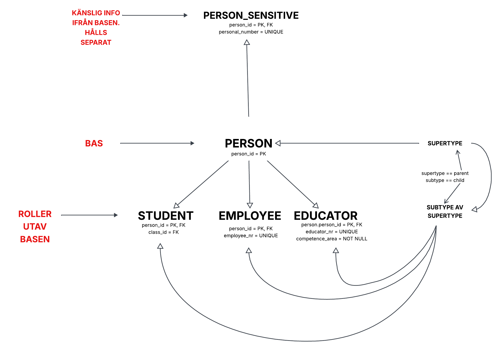

# Notes and sources for the Data Modeling lab Yrkesco. Data Engineering class of 2025 at STI.

## In these notes I will state my sources and where I have found information if I get stuck and need help.
- For example: Stackoverflow, LLM's, W3Schools, or python's own documentation.
If I have received help or found a solution for a block of code/query, I will mention this in my notes.md under the heading **sources**

## **Sources:**
### Modeling and cardinality
- https://github.com/AIgineerAB/data_modeling_course
- https://www.geeksforgeeks.org/data-engineering/data-modeling-in-data-engineering/
- https://www.geeksforgeeks.org/data-analysis/data-modeling-a-comprehensive-guide-for-analysts/
- https://www.geeksforgeeks.org/dbms/data-models-in-dbms/
- https://www.geeksforgeeks.org/dbms/cardinality-in-dbms/
- https://www.gleek.io/blog/erd-database-design
- https://www.gleek.io/blog/er-model-cardinality#google_vignette
- https://www.gleek.io/blog/er-model-cardinality
- https://www.red-gate.com/blog/crow-s-foot-notation 
- https://www.youtube.com/watch?v=tZsM9nN0SVQ&list=PLJEPF7xwqczsA-9PGJaokc4Y36ANtBEOD
- https://www.youtube.com/watch?v=ltQgbSs99WU&list=PLJEPF7xwqczsA-9PGJaokc4Y36ANtBEOD&index=2
- https://www.youtube.com/watch?v=fXndSzAL1Nc&list=PLJEPF7xwqczsA-9PGJaokc4Y36ANtBEOD&index=4
- https://www.youtube.com/watch?v=CUR6rKrIEGc&list=PLJEPF7xwqczsA-9PGJaokc4Y36ANtBEOD&index=10
- https://www.youtube.com/watch?v=NdeeSEknp58&list=PLJEPF7xwqczsA-9PGJaokc4Y36ANtBEOD&index=21

### Keys
- https://www.geeksforgeeks.org/dbms/types-of-keys-in-relational-model-candidate-super-primary-alternate-and-foreign/
- https://cstaleem.com/composite-attribute-in-dbms
- https://www.youtube.com/watch?v=8wUUMOKAK-c&list=PLJEPF7xwqczsA-9PGJaokc4Y36ANtBEOD&index=7

### Normalization
- https://learn.microsoft.com/sv-se/office/troubleshoot/access/database-normalization-description
- https://www.youtube.com/watch?v=GFQaEYEc8_8&list=PLJEPF7xwqczsA-9PGJaokc4Y36ANtBEOD&index=8

### Docker, PostgreSQL, SQL
- https://docs.docker.com/reference/cli/docker/container/stop/
- https://www.postgresql.org/docs/
- https://github.com/AIgineerAB/duckdb_sql_analytics_course
- https://www.youtube.com/watch?v=RUqGlWr5LBA&list=PLJEPF7xwqczvhfUm3svwPWStUc67yc_YS&index=5
- https://www.youtube.com/watch?v=DM65_JyGxCo&list=PLJEPF7xwqczvhfUm3svwPWStUc67yc_YS&index=11

## The use of LLMs
- The usage of LLMs in this lab has mainly been focused on guidance and to further deepen my knowledge in topics I felt was hard to understand. Using prompts to direct Gemini, GPT and Claude to take on roles and act as coaches and Senior Engineers to break down complex topics down in smaller pieces for understanding.   

- Example: How super/subtypes and shared Primary keys work. After getting Gemini to break it down for me with examples and explanations I made this diagram too see if I had understood the explanation it provided. 

# Conclusion
All final code, queries and interpretations are my own, external sources and LLMs have been used as support for deeper understanding and troubleshooting.